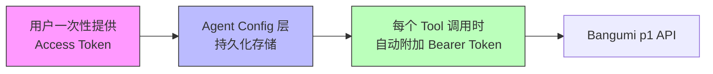

### Question1: ###
# 角色与任务
你是一个资深的架构分析师与全栈工程师。
我当前正在开发一个基于 FastAPI + LangGraph + Pydantic v2 构建的 Bangumi 智能 Agent 系统（项目大纲见下方）。
现在，我为你提供了一个名为 `bgm-cli` 的开源命令行工具代码仓库（用于操作 Bangumi API）。

你的核心任务是：**阅读 `bgm-cli` 的源码，提炼其获取和处理丰富数据的逻辑，并结合我的项目大纲，分析哪些能力可以被引入作为我的 Agent Tool。**

# 当前项目大纲 (Bangumi Agentic System)
- **核心定位**: RAG+Agent 的智能对话桌宠/助理。
- **技术栈**: Python 3.11+, FastAPI, Pydantic v2, SQLModel, LangGraph, OpenAI SDK。
- **M1-M3 状态**: 已完成底层 RAG（PGVector + 语义阶梯分桶排序），所有实时数据获取均留给未来的 Tools。
- **M4 状态**: 已完成 LangGraph 的“无头状态机”骨架，实现了 ReAct 循环、`reasoning_node` 和 `critic_node` 的熔断保护。
- **当前目标 (M4-Step2)**: 开始编写原生的 `tools/bgm_tools.py`，将外部能力封装为防御性极强的 Pydantic Tools。

# 分析执行步骤 (请严格按此输出)

## 1. 源码挖掘：它是如何拿到数据的？
请阅读 `bgm-cli` 的源码（特别是 HTTP 客户端、API 路由定义或相关的 service 文件），回答以下问题：
* 它主要调用了 Bangumi 的哪些 API 版本？（如 `v0` REST API 还是早期的网页爬虫/旧版接口）？
* （目前，我的agent只可以处理关于条目（番剧，角色，人物），没有设计关于：“用户”，“单集”的处理逻辑）针对在 `features.zh-CN.md` 中提到的“单集吐槽 (episode comments)”、“热门讨论 (trending topics)”、“时光机 (timeline)”、"浏览日志、查看日志评论、图片和关联条目"等内容，请精准提取出对应的 HTTP Method、URL 路由以及关键参数。

## 2. 逻辑解析：它是如何处理数据的？
* 它是如何处理用户的权限以及认证，access信息的?
* 观察它在接收到 API 返回的 JSON 数据后，是如何进行提取、组装或降级的？
* 它在处理敏感信息（如 R18 条目的权限校验）或空数据时，采用了什么策略？

## 3. 功能迁移评估：哪些适合成为 Agent Tool？
如果我想扩展我项目的“不局限一个问答智能助理”定位，从 `bgm-cli` 揭示的能力中，筛选出 **3-5 个最有价值的功能**，并说明：
* **为什么适合？**（例如：补充了 RAG 缺乏的实时情绪数据，或增强了私人代办能力）。
* **如果在 LangGraph 中实现，它的 Input Schema (Pydantic) 应该包含哪些关键字段？**

# 约束
- 保持专业、深入源码，不要只看它的文档，要看它怎么发请求的。
- 请直接输出分析报告，不需要马上开始写 Python 代码。

### Answer1: ###

# `bgm-cli` 源码深度分析报告

---

## 1. 源码挖掘：它是如何拿到数据的？

### 1.1 调用的 API 版本

`bgm-cli` **完全不调用 v0 公开 API**，而是全部走 Bangumi 的 **p1 private API**（可以理解为 v1 内网 API）。

| 组件 | 基底 URL | 用途 |
|---|---|---|
|

已完成: *Analyze bgm-cli source code for API interactions* (1/4)

**p1 API** | `https://next.bgm.tv` | 所有核心数据（条目、用户、收藏、小组、日志、时光机、搜索、Trending 等） |
| **OAuth** | `https://bgm.tv/oauth/access_token` | Token 颁发与刷新 |
| **状态监控** | `https://bgm-status.ry.mk` (第三方) | 社区维护的可用性状态 |

关键证据在 client.js 中：

```js
const PRIVATE_API_BASE_URL = "https://next.bgm.tv";
// 所有 this.request(path) 最终拼接为:
// fetch(`${PRIVATE_API_BASE_URL}${path}`, ...)  其中 path = "/p1/..."
```

### 1.2 各核心能力对应的 HTTP 请求

以下是从源码提取的精准路由，全部基于 `BangumiClient.request()` 方法（client.js）：

#### 单集吐槽（Episode Comments）

| 操作 | Method | URL 路由 | 关键参数 |
|---|---|---|---|
| 列出吐槽 | GET | `/p1/episodes/{episodeID}/comments` | 无额外参数 |
| 创建吐槽 | POST | `/p1/episodes/{episodeID}/comments` | body: `{ content, replyTo?, turnstileToken? }`, auth |
| 编辑吐槽 | PUT | `/p1/episodes/-/comments/{commentID}` | body: `{ content }`, auth |
| 删除吐槽 | DELETE | `/p1/episodes/-/comments/{commentID}` | auth |
| 贴表情 | PUT | `/p1/episodes/-/comments/{commentID}/like` | body: `{ value: number }`, auth |
| 取消表情 | DELETE | `/p1/episodes/-/comments/{commentID}/like` | auth |

#### 热门讨论（Trending Topics）

| 操作 | Method | URL 路由 | 关键参数 |
|---|---|---|---|
| 热门条目 | GET | `/p1/trending/subjects` | query: `{ type, limit, offset }` |
| 热门条目讨论 | GET | `/p1/trending/subjects/topics` | query: `{ limit, offset }` |

#### 时光机（Timeline）

| 操作 | Method | URL 路由 | 关键参数 |
|---|---|---|---|
| 列出全部/好友动态 | GET | `/p1/timeline` | query: `{ mode: "all"|"friends", limit, until }`, auth |
| SSE 事件流 | GET | `/p1/timeline/-/events` | query: `{ mode, cat, limit }`, auth, SSE 有界采样 |
| 用户时光机 | GET | `/p1/users/{username}/timeline` | query: `{ limit, until }`, auth |
| 吐槽回复列表 | GET | `/p1/timeline/{timelineID}/replies` | auth |
| 发布吐槽 | POST | `/p1/timeline` | body: `{ content, turnstileToken }`, auth |
| 回复吐槽 | POST | `/p1/timeline/{timelineID}/replies` | body: `{ content, replyTo?, turnstileToken? }`, auth |
| 删除 | DELETE | `/p1/timeline/{timelineID}` | auth |
| 表情反应 | PUT | `/p1/timeline/{timelineID}/like` | body: `{ value }`, auth |
| 取消反应 | DELETE | `/p1/timeline/{timelineID}/like` | auth |

#### 日志（Blog）

| 操作 | Method | URL 路由 | 关键参数 |
|---|---|---|---|
| 列出日志 | GET | `/p1/users/{username}/blogs` | auth |
| 获取单篇 | GET | `/p1/blogs/{entryID}` | auth |
| 日志评论列表 | GET | `/p1/blogs/{entryID}/comments` | auth |
| 回复日志/评论 | POST | `/p1/blogs/{entryID}/comments` | auth, body: `{ content, replyTo?, turnstileToken? }` |
| 编辑评论 | PUT | `/p1/blogs/-/comments/{commentID}` | auth, body: `{ content }` |
| 删除评论 | DELETE | `/p1/blogs/-/comments/{commentID}` | auth |
| 日志图片 | GET | `/p1/blogs/{entryID}/photos` | auth, query: `{ limit, offset }` |
| 日志关联条目 | GET | `/p1/blogs/{entryID}/subjects` | auth |

#### 用户（User）

| 操作 | Method | URL 路由 | 关键参数 |
|---|---|---|---|
| 获取自己资料 | GET | `/p1/me` | auth |
| 获取公开资料 | GET | `/p1/users/{username}` | — |
| 好友列表 | GET | `/p1/users/{username}/friends` | query: `{ limit, offset }` |
| 关注者列表 | GET | `/p1/users/{username}/followers` | query: `{ limit, offset }` |

#### 收藏（Collection）

| 操作 | Method | URL 路由 | 关键参数 |
|---|---|---|---|
| 列出收藏 | GET | `/p1/users/{username}/collections/subjects` | query: `{ subjectType, type, limit, offset }` |
| 新建/更新收藏 | PUT | `/p1/collections/subjects/{subjectID}` | auth, body: `{ type, rate, comment, private, tags }` |
| 部分更新收藏 | PATCH | `/p1/collections/subjects/{subjectID}` | auth, body: `{ epStatus, volStatus }` |
| 单集进度 | PATCH | `/p1/collections/episodes/{episodeID}` | auth, body: `{ type, batch }` |
| 角色/人物/目录收藏(增) | PUT | `/p1/collections/{characters\|persons\|indexes}/{id}` | auth |
| 角色/人物/目录收藏(删) | DELETE | `/p1/collections/{characters\|persons\|indexes}/{id}` | auth |

---

## 2. 逻辑解析：它是如何处理数据的？

### 2.1 权限与认证体系

认证分层设计在 `createHeaders(config, options)`（client.js 尾部）：

```
headers = {
  "User-Agent":  // 格式: "{developerId}/{appName}/{version} ({homepage})"
  "Accept": "application/json",
  "Content-Type": "application/json"  // 仅当有 body 时
}

// 第 1 层：Bearer Token（主认证）
if (options.auth !== false && config.accessToken 存在) {
  headers.Authorization = `Bearer ${accessToken}`
}

// 第 2 层：Private Session Cookie（补充认证，用于某些 p1 写操作）
if (path.startsWith("/p1/") && config.privateSessionId 存在) {
  headers.Cookie = `chiiNextSessionID=${privateSessionId}`
}
```

**关键洞察：**
- **非所有读操作都需要 auth**（如 `GET /p1/subjects/{id}` 不需要），但**写操作强制 `auth: true`**
- Private Session 作为第二认证因子，在 p1 路由下自动附带
- Turnstile Token 机制：对需要人机验证的写操作，CLI 支持自动拉起本地或托管的后端流程获取 token，再注入请求 body（如 `{ content, turnstileToken }`）
- OAuth2 完整流程（authorization_code grant）也支持，但 CLI 推荐直接保存 Access Token 作为主路径

### 2.2 JSON 数据提取、组装与降级

核心模式在 `normalizeSubject()` 和 `normalizeEpisode()` 中体现：

```js
// 展平嵌套 + 双命名兼容（camelCase ↔ snake_case）
function normalizeSubject(subject) {
  return {
    ...subject,
    name_cn: subject.name_cn ?? subject.nameCN,      // 兼容两种字段名
    date: subject.date ?? subject.airtime?.date,       // 从深层嵌套提高
    rank: subject.rank ?? subject.rating?.rank,        // 提取嵌套评分
    score: subject.score ?? subject.rating?.score,
    interest: subject.interest ? normalizeSubjectInterest(subject.interest) : undefined,
  };
}
```

**降级策略：**
- **空值兜底**：所有 `normalize*` 函数以 `if (!x || typeof x !== "object") return x` 开头，防御非对象输入
- **集合嵌套展平**：`normalizeSubjectInterestCollection()` 将 `interest` 子对象合并到顶层，同时保留 `subject` 子对象，形成半展平结构
- **分页吞并**：`normalizeSubjectPage()` 对 `result.data` 做 `.map(normalizeSubject)`，非数组时兜底为空数组 `[]`
- **API total 不可信时的降级**：`fetchAllCollections()` 在 `first.total` 非有限正数时，退化为**顺序逐页抓取**，直到空页或不满页为止

### 2.3 敏感信息与空数据处理策略

| 场景 | 策略 |
|---|---|
| **NSFW/R18 条目** | `episode list` 失败时通过 `handleEpisodeListError()` 给出专门提示；`GET /p1/subjects/{id}/episodes` 在未带 token 时可能返回误导性 404，因此 CLI 会自动附上 Bearer Token |
| **鉴权失败 (401)** | 直接提示"Save a valid Bangumi access token first with `bgm auth set-token`" |
| **权限拒绝 (403)** | 提示"Your account is authenticated but does not currently have permission" |
| **父条目未收藏** | `mapEpisodeMutationError()` 检测 `"need to add subject to your collection first"` → 给出可操作提示 |
| **写后验证** | `fetchMySubjectCollectionVerified()` 和 `fetchMyEpisodeCollectionVerified()` 在写操作后**最多重试 5 次**，每次递增延迟（350ms→1.4s），确认数据已持久化，否则抛出清晰错误 |
| **400 "no update"** | `isNoUpdateError()` 检测后吞掉错误返回 `{}`，避免无意义报错 |
| **Reaction 值校验** | `normalizeBangumiReactionValue()` 对每种目标（episodeComment/groupPost/subjectCollect/timeline）维护白名单数组，拒绝非法的表情值 |
| **SSE 超时保护** | `requestSseEvents()` 用 `AbortController` 和 `setTimeout` 做有界监听，避免命令行长期挂起 |
| **并发保护** | `fetchAllCollections()` 使用并发上限 8 的并行分页抓取，避免被限流 |

---

## 3. 功能迁移评估：哪些适合成为 Agent Tool？

针对你的项目定位（RAG+Agent 智能对话助理），我筛选出 **5 个最有价值的工具**：

---

### ① `get_timeline` — 时光机动态感知

**为什么适合？**
RAG 只能索引静态文档，但**时光机是 Bangumi 社区的实时情绪脉搏**。Agent 通过它感知到"今天大家都在讨论什么作品"、"好友最近看了什么"，能给出极富时效性的回答，突破 RAG 的知识截止日期。

**Input Schema（关键字段）：**

```python
class GetTimelineInput(BaseModel):
    mode: Literal["all", "friends"] = "all"          # 范围
    limit: int = Field(default=20, ge=1, le=100)     # 条数上限
    until: Optional[int] = None                      # 分页游标
    cat: Optional[Literal["daily", "wiki", "subject", "progress", "status", "blog", "index", "mono", "doujin"]] = None  # 事件类型过滤（仅 events 模式）
    use_events: bool = False                         # 是否使用 SSE 实时流（True 时走 /p1/timeline/-/events）
```

**返回模型建议：** 结构化的事件列表，每条包含：`type`（吐槽/收藏/评分/进度）、`user`、`subject`（关联作品）、`content`、`created_at`、`reactions`。

---

### ② `get_episode_comments` — 实时单集吐槽箱

**为什么适合？**
RAG 只能检索作品宏观信息。**单集吐槽箱承载着社区对新一集的即时反应、梗、槽点**，是 Agent 回答"这集大家怎么看？"的唯一数据源。而且这在 `bgm-cli` 中拥有完整的 CRUD + Reaction 全链路。

**Input Schema（关键字段）：**

```python
class GetEpisodeCommentsInput(BaseModel):
    episode_id: int                                   # 单集 ID
    limit: int = Field(default=20, ge=1, le=200)

class CreateEpisodeCommentInput(BaseModel):
    episode_id: int
    content: str = Field(..., max_length=2000)
    reply_to: Optional[int] = None                   # 回复某条评论
```

---

### ③ `get_trending` — 热门趋势感知

**为什么适合？**
Agent 在回答"最近什么番最火"、"大家都在讨论什么"时，需要一个**无偏见的社区热度信号源**。Trending API 直接提供这一维度，且无需认证。两条路由刚好覆盖"作品热度"和"讨论热度"两个层面。

**Input Schema（关键字段）：**

```python
class GetTrendingInput(BaseModel):
    category: Literal["subjects", "topics"] = "subjects"
    subject_type: Optional[Literal["book", "anime", "music", "game", "real"]] = None
    limit: int = Field(default=10, ge=1, le=50)
```

---

### ④ `manage_collection` — 用户收藏管家

**为什么适合？**
这是从"问答智能助理"到**"私人 Bangumi 管家"** 的跃迁关键。Agent 不再只是回答，还可以代表用户操作：添加收藏、打分、写评论、标记进度。

**Input Schema（关键字段）：**

```python
class CollectionActionInput(BaseModel):
    action: Literal["get", "list", "collect", "rate", "comment", "status", "episode_status", "episode_watch"]
    subject_id: Optional[int] = None
    episode_id: Optional[int] = None
    status: Optional[Literal["wish", "collect", "doing", "on_hold", "dropped"]] = None
    rate: Optional[int] = Field(default=None, ge=0, le=10)
    comment: Optional[str] = None
    episode_number: Optional[int] = None              # 供 episode_watch 使用
    search_keyword: Optional[str] = None              # 先搜索后操作的场景
```

**防御性设计建议：** 移植 `bgm-cli` 的"写后验证"模式（`fetchMySubjectCollectionVerified` 的轮询重试机制），确保操作已被 Bangumi 服务端真正持久化。

---

### ⑤ `get_user_social` — 社交图谱查询

**为什么适合？**
好友/关注者数据让 Agent 具备**社交维度感知**，可以回答"我的好友里谁收藏了这部番"、"这个用户和谁有社交关系"。这是 RAG 完全无法覆盖的动态人脉数据。

**Input Schema（关键字段）：**

```python
class GetUserSocialInput(BaseModel):
    username: Optional[str] = None                    # 留空则查当前登录用户
    relation: Literal["friends", "followers", "groups", "indexes"]
    limit: int = Field(default=20, ge=1, le=100)
    offset: int = Field(default=0, ge=0)
```

---

## 架构建议总结

| 维度 | 建议 |
|---|---|
| **Auth 层** | 在你的 LangGraph Tools 中复用 `Bearer Token` + `Private Session Cookie` 双层认证；将 `bgm-cli` 的 `createHeaders()` 逻辑移植为 Python 的 `httpx.Client` 中间件 |
| **错误处理** | 直接移植 `BangumiApiError` 的层次化错误分类（401/403/404/NSFW/父条目未收藏），并在 Tool 层熔断 |
| **数据归一化** | 移植 `normalizeSubject` / `normalizeEpisode` 的驼峰↔蛇形双兼容 + 嵌套展平策略 |
| **写后验证** | 收藏/单集进度等写入操作后，执行 3-5 次轮询验证（指数退避），确认服务端已持久化 |
| **并发控制** | 分页抓取时遵循 `bgm-cli` 的 8 并发上限，避免被 Bangumi 限流 |
| **Turnstile** | 写入操作预留 `turnstile_token` 参数，初期可以先走 `--manual` 模式的提示型交互 |

已完成: *Identify valuable features for Agent Tool integration* (4/4)

### Question2: ###
# 我的问题：
如果我的agent有太多“写”操作，是不是会太臃肿？注意我的项目是一个智能agent，有一些“与agent弱相关，甚至不需要调用llm的操作”引入我的项目反而无用？相反，大模型主要的能力是：检索信息，分析/总结信息，输出信息。
# 具体在功能上我的思考：
* 1.我目前的项目满足了静态检索存入数据库的信息的功能（番剧，人物，角色这类基本信息固定的数据）(帮我找一个80年代评分最高的机战番，这种问题Rag可以轻松回答)
* 2.分析/总结信息：我设想的对象是：单集吐槽(“海贼王的最新一话更新了，这一集“海米”们都觉得路飞帅呆了，但是作画又经费不足。。。”)，热门讨论（“xxx大热作品马上要改编成真人电影了。。。”），某个用户的时光机(用户"deepseek酱"给了《利兹与青鸟》打了满分，但是给《鬼灭之刃》打了6分，看来deepseek酱是一个小众文艺鉴赏者，而不是喜欢大热作品:))。反而，需要大量权限认证进行“写入，删，改”操作的任务，不是我关心的。
* 3.输出信息：这个是上下文以及日常对话的情况，比较容易解决，设置好prompts和记忆系统即可，不需要重型的api与权限操作
* 4.此外，由于bangumi好友功能并不完善，不需要引入所有关于“好友”的功能

**根据我的思考，给出你的规划和建议**

### Answer2: ###

## "需要 Auth" 的含义

从源码中，Bangumi p1 API 的认证头由 `createHeaders()` 函数生成（client.js）：

```js
// 两层认证：
headers.Authorization = `Bearer ${config.accessToken}`  // 第1层：Access Token
headers.Cookie = `chiiNextSessionID=${config.privateSessionId}`  // 第2层：Private Session Cookie
```

"需要 Auth" 意味着 **请求头必须携带 `Authorization: Bearer {accessToken}`**，否则 Bangumi 会返回 401。

具体到你这三个 Tool：

| Tool | 为什么需要 Auth？ | 源码依据 |
|---|---|---|
| `get_user_timeline` | 时光机包含"好友可见"动态，必须验证调用者身份 | `this.request(..., { auth: true })` |
| `get_blog_entry` | Blog 可能有权限限制（私密日志），需要验证身份 | `this.request(..., { auth: true })` |
| `collect_subject` | 写操作修改的是**当前用户**的收藏数据 | `this.request(..., { method: "PUT", auth: true })` |

---

## 在你的 Agent 中如何操作

**核心思路：不要把认证流程作为 Agent Tool，而是作为系统配置层。**



### 具体实现建议

**第 1 步：用户侧 — 一次性配置（不暴露为 Tool）**

在你的 Agent 配置系统（如 `config.py` 或环境变量）中增加两个字段：

```python
class BangumiConfig(BaseModel):
    access_token: str          # 从环境变量 BGM_ACCESS_TOKEN 读取
    private_session_id: Optional[str] = None  # 某些操作可能需要，可选
    user_agent: str = "your-agent-name/1.0 (https://your-project)"
    base_url: str = "https://next.bgm.tv"
```

用户只需要做一次：在 Bangumi 开发者设置中生成 Access Token，填入 `.env` 文件。

**第 2 步：Agent 侧 — 自动注入，对 LLM 透明**

在 `tools/bgm_tools.py` 中，每个 Tool 函数**不暴露 auth 参数给 LLM**，而是在函数体内自动从配置读取：

```python
# ✅ 正确做法：auth 对 LLM 完全透明
@tool
def get_user_timeline(username: str, limit: int = 30) -> dict:
    """获取指定用户的时光机动态"""
    headers = {
        "Authorization": f"Bearer {config.BGM_ACCESS_TOKEN}",
        "User-Agent": config.USER_AGENT,
        "Accept": "application/json",
    }
    resp = httpx.get(
        f"{config.BASE_URL}/p1/users/{username}/timeline",
        headers=headers,
        params={"limit": limit},
    )
    resp.raise_for_status()
    return resp.json()

# ❌ 错误做法：不要暴露 token 给 LLM
# def get_user_timeline(username: str, access_token: str, ...)
```

**第 3 步：Token 过期处理 — 后台静默刷新**

可以参考 `bgm-cli` 的 `OAuthClient.refreshToken()` 逻辑（client.js），在后台线程维护 token 新鲜度：

```python
# 在 Agent 启动时或 Tool 调用前，检查 token 是否有效
async def ensure_token_fresh():
    me = await request("/p1/me")  # token 无效会 401
    if me.status_code == 401:
        # 静默用 refresh_token 换新 access_token，不中断对话
```

---

## 三个 Tool 的 Auth 风险分级

| Tool | 无 Token 时的行为 | 建议 |
|---|---|---|
| `get_user_timeline` | **无法调用** → 401。用户时光机必须有 Auth | 必须在 Agent 启动时确保 token 存在，否则该 Tool 不可用 |
| `get_blog_entry` | **无法调用** → 401。同上有 Auth 要求 | 同上。如果用户不提供 token，这个 Tool 直接不注册到 Agent |
| `collect_subject` | **无法调用** → 401。写操作强制 Auth | 唯一写操作，要求更高。建议在调用前先用 `get_me` 验证 token 有效 |

---

## 推荐的 Tool 注册策略

```python
def register_bangumi_tools(config: BangumiConfig) -> list[BaseTool]:
    tools = []

    # 无需 auth 的 Tool — 始终可用
    tools.append(get_episode_comments)   # ✅ 无 auth
    tools.append(get_trending_topics)    # ✅ 无 auth

    # 需要 auth 的 Tool — 有 token 才注册
    if config.access_token:
        tools.append(get_user_timeline)   # 需 auth
        tools.append(get_blog_entry)      # 需 auth
        tools.append(collect_subject)     # 需 auth（唯一写操作）
    else:
        logger.info("未配置 Access Token，以下 Tool 不可用：时光机、日志、收藏")

    return tools
```

这样，**Agent 的能力是"按需激活"的**：用户提供了 token，就多三个能力；不提供，Agent 依然可以用两个免 auth 的 Tool 正常工作。

---

**总结一句话：** "需要 Auth" 意味着你必须让 Agent 持有 Bangumi Access Token（存在配置/环境变量里），每次 API 调用时自动附加 `Bearer` 头。**不要让认证流程本身成为 Tool、不要让 LLM 管理 Token。**

更新了待办事项列表


###
# blog
## 1./p1/blogs/{entryID}
## 2./p1/blogs/{entryID}/comments
## 3./p1/blogs/{entryID}/subjects

# calender
## 1./p1/calendar

# character
## 1./p1/characters/{characterID}
## 2./p1/characters/{characterID}/casts
# collection
## 3./p1/characters/{characterID}/comments

# episode
## 1./p1/episodes/{episodeID}
## 2./p1/episodes/{episodeID}/comments

# group

# topic

# person
## 1./p1/persons/{personID}
## 2./p1/persons/{personID}/casts
## 3./p1/persons/{personID}/comments
## 5./p1/persons/{personID}/relations
## 6./p1/persons/{personID}/works

# user
## 1./p1/users/{username}
## 2./p1/users/{username}/blogs
## 3./p1/users/{username}/collections/characters
## 4./p1/users/{username}/collections/persons
## 5./p1/users/{username}/collections/subjects

# subject
## 1./p1/subjects
## 2./p1/subjects/-/topics
## 3./p1/subjects/{subjectID}
## 4./p1/subjects/{subjectID}/characters
## 5./p1/subjects/{subjectID}/comments
## 6./p1/subjects/{subjectID}/episodes
## 7./p1/subjects/{subjectID}/reviews
## 8./p1/subjects/{subjectID}/staffs/persons
## 9./p1/subjects/{subjectID}/staffs/positions
## 10./p1/subjects/{subjectID}/topics

# trending
## 1./p1/trending/subjects
## 2./p1/trending/subjects/topics
