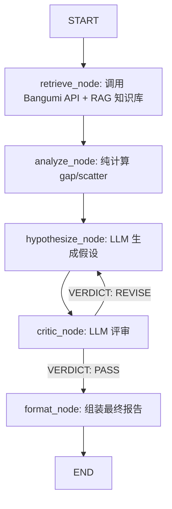

Let me systematically read all the core source files to build a comprehensive architecture analysis.
现在我已经完整阅读了所有核心源码，下面给出架构对比与学习报告。

---

# 架构对比与学习报告：`bangumi-data-analyst-agent` vs 你的 Bangumi Agentic System

---

## 一、核心架构提取

### 1.1 Agent 框架选型

| 维度 | bangumi-data-analyst-agent | 你的项目 (当前/规划) |
|---|---|---|
| **框架** | **OpenAI Agents SDK** (`openai-agents>=0.2.0`) | LangGraph（规划中） |
| **模型网关** | `litellm` 代理层，配置为 `vertex_ai/gemini-2.5-flash` | DeepSeek-V3 / Qwen |
| **多Agent组织方式** | `Agent.as_tool()` 模式——子Agent被封装为父Agent的工具 | LangGraph 状态机 |
| **编排模式** | **中心化编排**：单一 Orchestrator 按顺序调用 specialist tools | 状态图 DAG |

**关键发现**：它用的是 OpenAI Agents SDK 而非 LangGraph。这个 SDK 的 `Agent.as_tool()` 是一个非常轻量的多Agent实现——子Agent被"降级"为工具调用，由父Agent在一个固定的顺序中调用。**这不是真正的 peer-to-peer 多Agent协作**，更像是"一个主Agent + 多个被调用的子Agent函数"。

---

### 1.2 Collect → Explore → Hypothesize 链路

它的链路由 service.py 中的 `run_agent_season_gap_analysis()` 实现，核心流转如下：

```
┌──────────────────────────────────────────────────────────────┐
│                    Orchestrator Agent                        │
│  instructions: ORCHESTRATOR_PROMPT                          │
│  tools: [retrieval_specialist, eda_specialist,               │
│          hypothesis_specialist]  (均以 as_tool() 包装)        │
│  max_turns: 10                                               │
│                                                              │
│  步骤1: run_retrieval_specialist ──► 调用 Bangumi API         │
│          ↓                                                   │
│  步骤2: run_eda_specialist ──► 使用已预取的数据做分析          │
│          ↓                                                   │
│  步骤3: run_hypothesis_specialist ──► 产出假设                │
│          ↓                                                   │
│  输出: orchestrator_output (markdown report)                 │
└──────────────────────────────────────────────────────────────┘
                              ↓
┌──────────────────────────────────────────────────────────────┐
│                    Critic Specialist                          │
│  输入: orchestrator_output                                   │
│  输出: VERDICT: PASS | REVISE + 批评意见                      │
│  max_turns: 4                                                │
└──────────────────────────────────────────────────────────────┘
                              ↓
              final_report = orchestrator_output + critic check
```

**数据流的关键设计——"预取再分析"模式**：

```
Bangumi API ──► AgentWorkflowBackend.prefetched_rows_by_season (dict 缓存)
                                      │
                ┌─────────────────────┼─────────────────────┐
                ↓                     ↓                     ↓
        retrieval_specialist    eda_specialist      后续分析链路
        (只读快照摘要)          (调用已有分析函数)
```

`AgentWorkflowBackend` 是整个 Agent 工作流的**共享上下文对象**，它：
1. 持有 `prefetched_rows_by_season: dict` 缓存已抓取的数据
2. 提供 `fetch_runtime_season_snapshots()` 给 retrieval specialist
3. 提供 `run_prefetched_season_gap_analysis()` 给 EDA specialist
4. 保证 **数据只拉取一次**，后续 agent 复用同一份数据

---

### 1.3 两条路径：确定性分析 vs Agent 分析

该项目提供了两条并行的分析路径：

| | 确定性路径 | Agent路径 |
|---|---|---|
| **端点** | `POST /api/v1/analysis/season-gap` | `POST /api/v1/agent/season-gap` |
| **实现** | 直接调用 `run_season_gap_analysis()` | 通过5个Agent协作 |
| **LLM参与** | 无（纯 pandas + numpy 计算） | 全程 LLM 驱动 |
| **假设生成** | `build_hypothesis()` 模板函数 | hypothesis_specialist LLM 生成 |
| **质量检查** | 无 | Critic agent PASS/REVISE |
| **速度** | 快 | 慢（多次 LLM 调用） |

这是一个很好的设计模式：**将核心计算逻辑解耦为纯函数，Agent 只是调用这些函数的"智能壳"**。

---

## 二、与你项目的异同点对比

### 2.1 相同点

| 维度 | 两者 |
|---|---|
| **业务域** | Bangumi 动画数据 |
| **数据源** | Bangumi.tv 官方数据 |
| **分析目标** | 季度对比、评分-热度 gap 分析 |
| **技术栈** | Python + FastAPI + Pydantic |
| **多Agent理念** | 都有 specialist 角色分工 |

### 2.2 不同点——核心差异在于"运行时数据" vs "静态知识库"

| 维度 | bangumi-data-analyst-agent | 你的 Bangumi Agentic System |
|---|---|---|
| **数据策略** | **Runtime external data source**——每次请求实时调用 Bangumi API | **RAG + 静态知识库**（PostgreSQL + PGVector，Distance 阈值 + Top-K） |
| **数据新鲜度** | 始终最新（实时API） | 取决于知识库更新频率 |
| **延迟** | 高（API调用 + 限流等待） | 低（本地向量检索） |
| **覆盖范围** | 仅限 Bangumi API 能返回的数据 | 可以摄入更丰富的离线语料 |
| **离线可用** | 不可用 | 可用 |

### 2.3 Bangumi API 调用机制详解

它的 API 客户端 (client.py) 设计非常简洁：

```python
# 核心调用链
BangumiClient (httpx.AsyncClient)
  └── fetch_season_subjects()
        └── GET /v0/subjects?type=2&year=X&month=Y&sort=rank&limit=N&offset=M
              └── 按 page_limit 分页循环
              └── 页间 sleep(bangumi_request_pause_seconds)  # 默认 0.2s
```

**鉴权机制**：
- Bearer Token（可选），通过环境变量 `BANGUMI_TOKEN` 注入
- 无 Token 时也能以未认证模式访问公开 API
- `User-Agent` 头自定义标识

**限流策略——极其简单**：
- **仅有** `asyncio.sleep(0.2)` 的页间停顿
- **没有任何**指数退避、重试、429 状态码处理
- 这是一个明显的短板——生产环境 Bangumi API 有严格的频率限制

---

## 三、高价值借鉴点 (Actionable Insights)

### 3.1 ★ 最佳设计 #1：角色约束型 Prompt 模板

它的 Prompt 设计非常克制和精准，每个 specialist 有明确的**禁止事项**：

```
# retrieval_specialist 的核心约束：
- Do not perform causal interpretation.
- Do not propose hypotheses.
- Return compact, concrete evidence only.

# eda_specialist 的核心约束：
- Do not call Bangumi again.
- Do not explain causes.
- Do not speculate beyond the returned metrics.

# hypothesis_specialist 的核心约束：
- Propose one narrow evidence-backed hypothesis.
- Explicitly note the main uncertainty.
- Do not invent new facts, titles, or metrics.
```

**值得借鉴的点**：
- 每个 Agent 的 Prompt 中 **"Rules" 部分的价值远大于 "Instructions" 部分**
- **用否定句约束边界比用肯定句描述任务更有效**
- 要求输出固定 Markdown 章节（`## EDA findings`、`## Caveats`）——这等价于隐式的结构化输出，比 JSON schema 更容错

**对你的建议**：在 LangGraph 的每个 node 的 system prompt 中，采用相同模式——先写 Rules（禁止做什么），再写期望的输出格式。

### 3.2 ★ 最佳设计 #2：Critic Agent 模式

```python
# 独立的 critic，不在 orchestrator 内部
critic_specialist = Agent(
    name="critic_specialist",
    instructions=CRITIC_SPECIALIST_PROMPT,
    model=model,
)
# 输出格式强制：第一行必须是 VERDICT: PASS 或 VERDICT: REVISE
```

Critic prompt 的精髓：
> "Your only job is to determine whether the hypothesis is actually supported by the findings. Do not rewrite the report. Do not add new evidence."

**值得借鉴的点**：
- Critic 是一个**外挂式的独立Agent**，不在 Orchestrator 的 tool 列表中——这保证了它不会被 Orchestrator 的推理过程污染
- 强制二分类输出（PASS/REVISE），用正则 `_extract_verdict()` 提取——简单、可解析、可自动化

**对你的建议**：在 Milestone 4 的 LangGraph 状态机中，将 Critic 设计为一个**条件边上的守卫节点**——如果 Critics 给出 REVISE，状态回退到 hypothesis 节点重新生成。

### 3.3 ★ 设计模式：数据预取 + 分析解耦

`AgentWorkflowBackend` 的设计是一个很好的**关注点分离**案例：

```
数据层 (BangumiClient + prefetched_rows)  ← 纯 I/O
       ↓
分析层 (run_season_gap_analysis_from_prefetched_rows)  ← 纯计算（可测试）
       ↓
Agent层 (specialists as tools)  ← LLM 编排
```

对你的启示：在 LangGraph 实现中，建议将：
- **数据获取** 封装为 `tool` node（可被 MCP 工具调用替代）
- **分析计算** 封装为 `pydantic` 函数 node
- **LLM 推理** 仅在需要自然语言理解和生成时使用

### 3.4 值得注意的短板（不建议引入的设计）

| 问题 | 说明 |
|---|---|
| **Chat 服务无 LLM** | service.py 的 `answer_bangumi_question()` 完全基于正则匹配 + if-else 分支做意图识别和回答生成，没有任何 LLM 调用。这种硬编码方式不可扩展 |
| **API 限流处理过于简陋** | 仅 `sleep(0.2)`，无重试、无退避、无 429 处理 |
| **Agent 编排耦合于 SDK** | `Agent.as_tool()` 是 OpenAI Agents SDK 特有模式——你用的是 LangGraph，不应照搬 |
| **placeholders.py 是死代码** | 定义了 `build_placeholder_agents()` 但从未被调用，属于过度设计 |
| **Hypothesis 的 template 函数过于简单** | `build_hypothesis()` 只有 ~20 行 if-else，远不如 LLM 生成的假设有深度 |

---

## 四、对 Milestone 4 & 5 的具体建议

### 4.1 对 Milestone 4（LangGraph 单体大脑）

建议的状态图设计：



关键点：
- `retrieve_node` 同时调用 Bangumi API（参考它的 client 设计）+ 你的 PGVector RAG
- `analyze_node` 是纯 Python 计算（参考它的 season_gap.py），不需要 LLM
- `critic_node → hypothesize_node` 形成 conditional edge 回路

### 4.2 对 Milestone 5（MCP/Skills）

- 将 `BangumiClient` 封装为 **MCP tool**，这样 Agent 可以动态决定调用哪些 API 参数
- 将 `run_season_gap_analysis` 的计算逻辑封装为 **Skill**（纯函数，无副作用）
- 将 Critic 检查封装为独立的 **evaluator skill**，可复用于不同的分析任务
- 该项目的 schemas.py（Pydantic 模型）可以直接参考用于 MCP tool 的 input/output schema 定义

### 4.3 最值得复用的 Prompt 模式

将以下 Prompt 约束模式直接移植到你的 LangGraph node 中：

1. **"Propose one narrow evidence-backed hypothesis. Explicitly note the main uncertainty."** — 这个约束质量很高
2. **"Do not invent new facts, titles, or metrics."** — 防止 LLM 幻觉的关键约束
3. **固定输出章节格式** — 比 JSON mode 更灵活，比自由文本更结构化

---

## 总结

这个开源项目是一个**结构清晰、职责分明**的课程级项目。它的核心价值在于：

1. **"预取再分析"的数据流设计**——数据层和分析层完全解耦
2. **角色约束型 Prompt**——用否定句界定Agent边界
3. **外挂式 Critic 模式**——用 PASS/REVISE 做质量门禁
4. **确定性路径 + Agent 路径双轨制**——兼顾性能和智能

但不值得照搬的部分是：硬编码的 Chat 意图识别、简陋的 API 限流、以及 OpenAI Agents SDK 特有的 `as_tool()` 编排模式。你应该用 LangGraph 的状态图来重新实现这些核心理念，同时用 PGVector RAG 增强数据覆盖范围。

已完成: *Scan and read core source files* (1/4)
